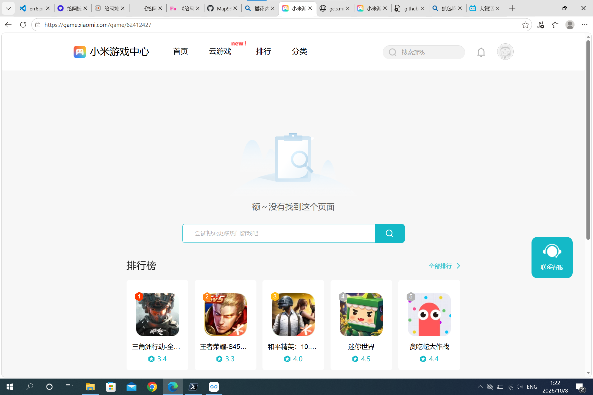

# com.lew.game.chdr

插花达人 apk 备份

<https://game.xiaomi.com/game/62386340>

## 商店下载直链：

<https://gc.s.migames.com/gdownload/api/c/download?c=app&v=download&package=com.lew.game.chdr.mi&channel=meng_1439_352_android>

10月6日21:56分还在，2026年10月8日上述俩链接已经失效

接口仍返回 HTTP 200，但内容是错误 JSON，不是安装包：

```json
{"cid":"meng_1439_352_android","errCode":10201,"extId":1358773}
```

`errCode 10201` = 商店已下架。去掉 `channel` 参数同样返回 10201，所以不是参数问题。

## 页面已下线证据



## github备份下载链接：

安装包校验信息：

| 项 | 值 |
|---|---|
| 大小 | 52,329,505 字节（49.9 MB） |
| MD5 | `defd144e8d6c89e4f52ccac053d6591c` |
| ZIP 条目数 | 3846 |

> 注意：文件名里的 `baaadf4b1196f64b28a46dccf496380a` **不是** MD5，
> 只是原始文件名。校验请用上面这个 MD5。

raw 直链（**LFS 感知，返回真实安装包**）：

<https://media.githubusercontent.com/media/Map9876/com.lew.game.chdr/main/baaadf4b1196f64b28a46dccf496380a.apk>

GitHub 网页下载（会重定向到 CDN）：

<https://github.com/Map9876/com.lew.game.chdr/raw/main/baaadf4b1196f64b28a46dccf496380a.apk>

> ⚠️ 不要用 `raw.githubusercontent.com/...`：该路径对 Git LFS 文件只返回
> 133 字节的**指针文本**（内容形如 `version https://git-lfs.github.com/spec/v1`），
> 不是安装包。要真实内容必须用上面的 `media.githubusercontent.com/media/...`。

### 下载后务必校验

APK 走 Git LFS，**下载被截断时不会报错，只会得到一个打不开的文件**。
判断方法（任选其一）：

```bash
# 1) 大小必须是 52329505 字节，明显偏小就是残包
ls -l baaadf4b1196f64b28a46dccf496380a.apk

# 2) MD5 应为 defd144e8d6c89e4f52ccac053d6591c
md5sum baaadf4b1196f64b28a46dccf496380a.apk

# 3) ZIP 结构完整（结尾记录 EOCD 必须存在）
python3 -c "d=open('baaadf4b1196f64b28a46dccf496380a.apk','rb').read(); print('完整' if d[:4]==b'PK\x03\x04' and d.rfind(b'PK\x05\x06')>0 else '残包')"

# 4) 或直接校验内部条目
unzip -t baaadf4b1196f64b28a46dccf496380a.apk | tail -2
```

> 残包的典型特征：有 `PK\x03\x04` 开头（所以看着像压缩包），但**没有**结尾的
> `PK\x05\x06`。这是因为 ZIP 的目录在文件末尾，被截断就没了。
>
> 本仓库曾收到过两次残包（17 MB / 3 MB），都是上传中途连接被掐断所致。

> 残包的典型特征：有 `PK\x03\x04` 开头（所以看着像压缩包），但**没有**结尾的
> `PK\x05\x06`。这是因为 ZIP 的目录在文件末尾，被截断就没了。

## 仓库内容

| 文件 | 说明 |
|---|---|
| `README.md` | 本文件 |
| `xiaomi-game-center-404.png` | 小米游戏中心页面 404 截图 |
| `*.apk` | 备份的安装包（走 Git LFS） |

## 应用信息

| 项 | 值 |
|---|---|
| 包名 | `com.lew.game.chdr.mi`（小米渠道版） |
| 版本 | 1.0.2 / 1.1.3（各渠道不一） |
| 大小 | 约 50 MB |
| 类型 | 休闲益智 / 三消 |

> 注：`*.apk` 已配置 Git LFS（见 `.gitattributes`），避免多次备份撑大仓库历史。
> 下载直链请用 Release 或 raw 链接；私有仓库需要带令牌访问。
